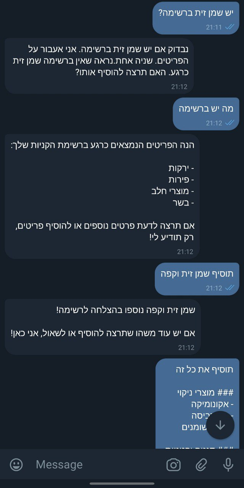
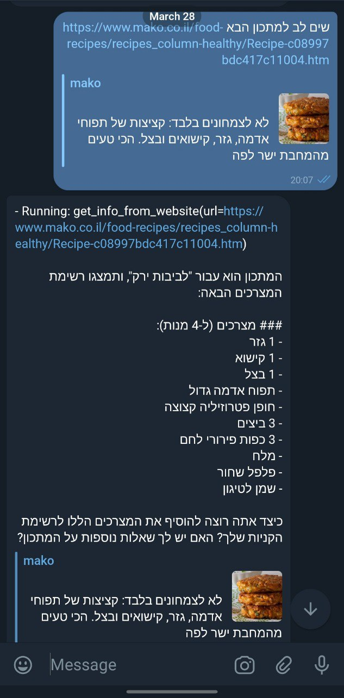
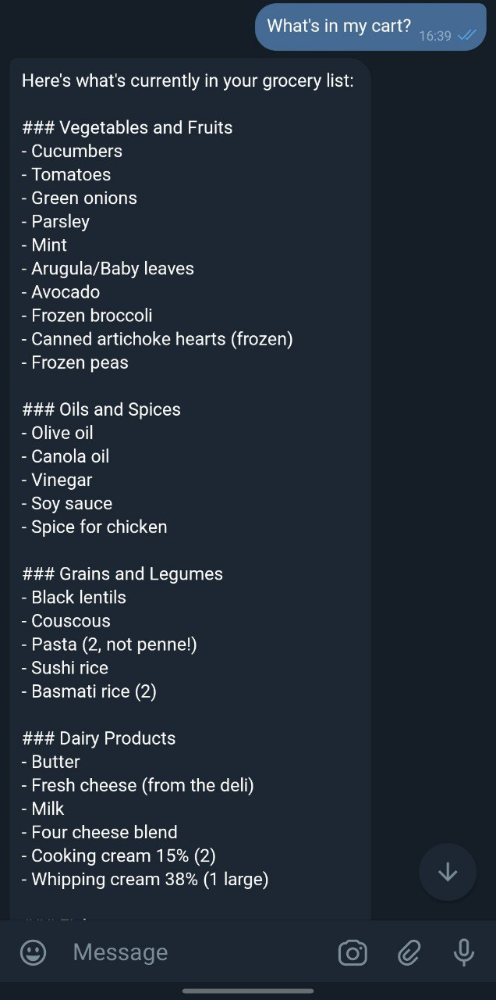

# Grocery Assistant Bot

Welcome to the Grocery Assistant Bot! This Telegram bot helps you manage your grocery list efficiently. With its intelligent features, you can easily add, remove, and organize items in your grocery list.

## Features

- **Manage Grocery List**: Add or remove items from your grocery list.
- **Recipe Integration**: Add ingredients from recipes directly from URL to your grocery list.
- **Categorization**: Organize items by category (produce, dairy, meat, etc.).
- **Duplicate Detection**: Automatically check for duplicate items and consolidate quantities.

## Installation

1. Clone the repository:
   ```bash
   git clone https://github.com/yourusername/grocery_bot.git
   cd grocery_bot
   ```

2. Install the required packages:
   ```bash
   pip install -r requirements.txt
   ```

3. Set up your environment variables (Telegram and OpenAI tokens) by renaming `.env.example` to `.env` file and filling in the tokens.

## Installation for Docker
```
docker build -t grocery-telegram-bot .
docker run -d -e TELEGRAM_KEY="<YOUR_TELEGRAM_TOKEN>" grocery-telegram-bot
```

## Usage

1. Start the bot by running:
   ```bash
   cd src
   python bot.py
   ```

## Screenshots

Here are some screenshots of the bot in action:


*Adding an item to the grocery list*


*Adding ingredients from a recipe*


*Viewing your grocery cart*

## Contributing

We welcome contributions! Please fork the repository and submit a pull request for any improvements or features.